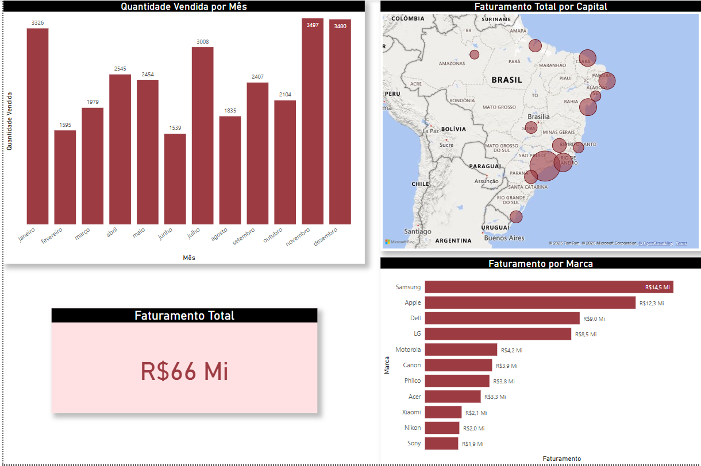

# Dashboard no Power BI 📊

No Power BI, criei um dashboard dinâmico utilizando uma planilha do Excel como base. O painel apresenta gráficos informativos, incluindo o **Faturamento Total, Faturamento por Marcas, Faturamento Total por Capital e a Quantidade Vendida por Mês.** Essa visualização facilita a análise de dados e proporciona insights valiosos sobre o desempenho de vendas. A integração entre Excel e Power BI otimiza a apresentação das informações, tornando-as mais acessíveis e compreensíveis

# Como Funciona 📌

No dashboard do Power BI, cada gráfico é projetado para oferecer uma experiência interativa ao usuário. Ao passar o mouse ou clicar em um gráfico, como o de Faturamento por Marcas, os dados correspondentes são destacados, permitindo uma análise detalhada. Por exemplo, ao selecionar o gráfico de Faturamento por Marcas, é possível visualizar a contribuição de cada marca para o faturamento total, com informações adicionais que surgem em destaque. Essa interatividade ajuda a identificar quais marcas estão se destacando e onde estão as oportunidades de crescimento. Além disso, os gráficos estão interligados, permitindo que as seleções em um gráfico influenciem as visualizações em outros, tornando a exploração dos dados mais rica e dinâmica. Essa abordagem oferece uma visão abrangente do desempenho das vendas, facilitando a tomada de decisões informadas.

# Tecnologias 💻⚙
As seguintes ferramentas que foram utilizadas na construção do projeto:
<table>
  <thead>
    <td> <b>Microsoft Excel:</b> Utilizado como a fonte de dados, permitindo a organização e manipulação eficiente das informações antes de serem importadas para o Power BI.</td>
  </thead>
  <tbody>
    <thead>
      <td> <b>Power BI:</b> Plataforma de visualização de dados que transforma informações em dashboards interativos, facilitando a análise e a apresentação de dados complexos de forma acessível. </td>
    </thead>
    <thead>
      <td> <b>DAX (Data Analysis Expressions):</b> Linguagem de formulação utilizada no Power BI para criar cálculos e medidas personalizadas, permitindo análises mais profundas e insights detalhados.</td>
    <thead>
      <td> <b>Geolocalização:</b> Recurso utilizado para representar dados em mapas, como o Faturamento Total por Capital, oferecendo uma visualização clara das variações regionais nas vendas.</td>
    </thead>
    <thead>
      <td> <b>Drill-Down:</b> Técnica que permite aprofundar a análise, possibilitando que o usuário clique em um gráfico para visualizar dados mais detalhados, como subdivisões por categorias ou períodos específicos, enriquecendo a compreensão dos dados.</td>
    </thead>
  </tbody>
</table>
